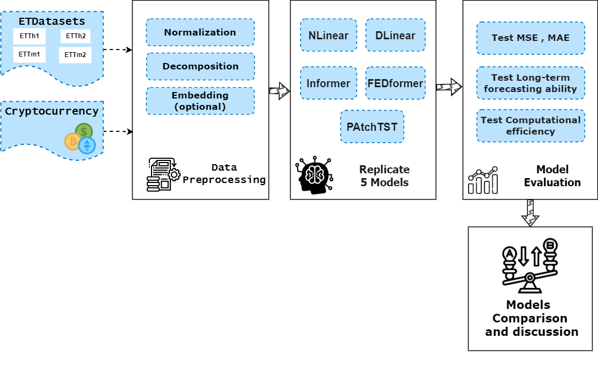

---
# Time Series Forecasting with Linear and Transformer Models

---
Code based on [LTSF-Linear](https://github.com/cure-lab/LTSF-Linear)



## Project Overview

For time series containing C variates, give historical data, train the datasets on five diffrent model architechture and then predict future values at T future time steps. The main goal is to further compare a two simple linear model (Dlinear and Nlinear) for time series forecasting with two diffrent transformer-based model (Informer and FEDFromer) with the recently published transformer-based approach (PatchTST). 

To Evaluate the model, historical cryptocurrency dataset is utilized with the objective of constructing time series forecasting models. A time series analysis is carried out to extract information from the entire dataset and preprocess the data by incorporating additional features. Subsequently, an ARIMA model is selected as the traditional baseline model. Several neural network time series models, including DLinear, NLinear, Informer, FEDformer, and PatchTST, are then assessed on the data to examine their forecasting performance in comparison to the ARIMA baseline.


---
## Datasets
We use 4 popular multivariate datasets provided in (Wu et al., 2021) for forecasting and representation learning. ETT7(Electricity Transformer Temperature) datasets are collected from two different electric transformers labeled with 1 and 2, and each of them contains 2 different resolutions (15
minutes and 1 hour) denoted with 'm' and 'h'. Thus, in total we have 4 ETT datasets: ETTm1, ETTm2, ETTh1, and ETTh2.

Another popular dataset from [kaggle](https://www.kaggle.com/competitions/g-research-crypto-forecasting/data) is used to Evalute the five selected models on it. This dataset contains historical trading data for multiple cryptocurrencies such as Bitcoin and Ethereum. Timestamps are represented in minutes and correspond to ID numbers which map to specific cryptocurrencies. Columns include the total number of trades, open, high, low and close prices, trade volume, volume weighted average price, and target residual log-returns over a 15 minute period.

---
## Solution Approach

**(1)** Replicate linear models (Dlinear, Nlinear) and transformer models (FEDFormer, Informer, and PatchTST) based on the papers' official repository and pipelines. This ensures accurate reproduction of the models.

**(2)** Train four historical dataset ([ETDataset](https://github.com/zhouhaoyi/ETDataset.git)) on the five replicated models.

**(3)** Select a time series dataset from [Kaggle](https://www.kaggle.com/competitions/g-research-crypto-forecasting/data?select=train.csv). Make some Exploartion and preprocessing on the whole dataset and then apply ARIMA model on one of the cryptoassets (`Datasets/CustomDatsets/cryptoh1.csv`).

**(4)** Train the selected dataset (`cryptoh1.csv`) on the three models,Dlinear, Informer , and PatchTST.

**(5)** Evaluate the trained models on the held-out test set. Compare their performances in:

- Quantitative metrics (e.g. MSE, MAE)
- Long-term forecasting ability (predictions at further time steps T)
- Computational efficiency

**(6)** Analyze the results qualitatively:

- Determine if/when the transformer model outperforms the linear model
- Understand the strengths and weaknesses of each approach
- Identify scenarios where one approach is preferred over the other

---
## Prepocessing Datasets

The data preprocessing steps mentioned in (Zeng, 2023) include normalization with zero-mean, and seasonal-trend decomposition. Autoformer first applies seasonal-trend decomposition behind each neural block, which is a standard method in time series analysis to make raw data more predictable. Specifically, they use a moving average kernel on the input sequence to extract the trend-cyclical component of the time series. The difference between the original sequence and the trend component is regarded as the seasonal component. 

## BaseLine Models

NLinear and DLinear are simple linear models with normalization, while Informer, FEDformer and PatchTST are more complex attention-based models that use Transformer architectures for time series forecasting.

- **NLinear:** NLinear first subtracts the input by the last value of the sequence. Then, the input goes through a linear layer, and the subtracted part is added back before making the final prediction. The subtraction and addition in NLinear are a simple normalization for the input sequence.

- **DLinear:** A combination of a Decomposition scheme used in Autoformer and FEDformer with linear layers. It first decomposes a raw data input into a trend component by a moving average kernel and a remainder (seasonal) component. Then, two one-layer linear layers are applied to each component and we sum up the two features to get the final prediction. By explicitly handling trend, DLinear enhances the performance of a vanilla linear when there is a clear trend in the data.

## Former Models

- **Informer:** An attention-based model for time series forecasting proposed in 2019. It uses a Transformer encoder-decoder architecture with causal self-attention and cross attention.

- **FEDformer:** An improvement on Informer proposed in 2021. It uses feature-wise decomposition which decomposes the input into different features before feeding them into separate transformers. This helps capture different patterns in the data.

- **PatchTST:** It divide the time series data into patches or segments and then use self-attention mechanisms to capture temporal dependencies within each patch. By dividing the time series into smaller segments, PatchTST can effectively process long sequences and better capture complex patterns in the data.

---
## Getting Started

To get a local copy up and running follow these simple example steps.

### **Prerequisites**

First, please make sure you have installed Conda. Then, our environment can be installed by:

  ```sh
    conda create -n group3_env python=3.9.16
    conda activate group3_env
    pip install -r requirements.txt
  ```
> Run each notebook speratly.

---
## Directories Description

| Directory | Description |
|---|---|
| **Datasets** | This directory contains the datasets used in the project, 4 `ETDatasets` and `Bitcoin` dataset. |
| **exp** | This directory contains files related to experiments conducted during the project to train the five selected models. |
| **models** | This directory contains the source code for the model architecture used in the project for all the five selected models. |
| **layers** | This directory contains the source code for the layers used in all the models. |
| **utils** | This directory contains utility functions used throughout the project, such as data preprocessing functions, evaluation metrics, and visualization functions. |
| **prepare_data** | This directory contains scripts that preprocess the raw data and convert it into a format suitable for training. |
| **Checkpoints** | This directory contains saved model checkpoints that can be loaded for further training, testing or inference. |
| **results** | This directory contains any output files generated during the project prediction results in Numpy format (.npy). |
| **test_results** | This directory contains the visualization graphs of model testing in PDF format. |
| **Images** | This directory contain any images used in the project in markdown or in README files. |

* `exp_Informer.py`: Contains the train, validation, testing (with visualization), and prediction of the Informer model.
* `exp_FEDFormer.py`: Contains the train, validation, testing (with visualization), and prediction of the FEDFormer model.
* `exp_PatchTST.py`: Contains the train, validation, testing (with visualization), and prediction of the PatchTST model.
* `exp_Dlinear.py`: Contains the train, validation, testing (with visualization), and prediction of the Dlinear model.
* `exp_Nlinear.py`: Contains the train, validation, testing (with visualization), and prediction of the Nlinear model. 

## Notebooks Description
For the following 5 notebooks, a step-by-step guide for replicating the the model and training it on the ETDataset (ETTh1, ETTh2, ETTm1, and ETTm2), ensuring accurate reproduction of the models by comparing the notebook results with the official paper results. The main foucs here is to study the *impact of number of prediction length on the performance*. 

- **Training-DLinear-on-ETT-datasets.ipynb**
- **Training-NLinear-on-ETT-datasets.ipynb**
- **Training-Informer-on-ETT-datasets.ipynb**
- **Training-FEDformer-on-ETT-datasets.ipynb**
- **Training-PatchTST-on-ETT-datasets.ipynb**
- **Training-five-models-on-Bitcoin.ipynb**
This notebook replicate five different models on the Bitcoin cryptocurrency dataset. The models are DLinear, NLinear, Informer, FEDformer, and PatchTST on `Bitcoin` datset explored in `Crypto-Forecasting-EDA-Testing-on-5models` notebook. For each model we will use four diffrent combination of hyperparameters. The main foucs here is to study the *impact of number of prediction length on the performance*. 

- **Crypto-Forecasting-EDA-Testing-on-5models.ipynb**
This notebook use historical cryptocurrency trading data with the aim of building time series forecasting models. General exploratory data analysis is performed to gain an overview of the full dataset and prepare the data for modeling. Specific preprocessing and analysis is then done on the data (cryptoh1) to characterize the time series and identify appropriate models. An **ARIMA** model is chosen as the traditional baseline model. Several neural network time series models are then evaluated on the Bitcoin data, including **DLinear**, **NLinear**, **Informer**, **FEDformer** and **PatchTST**, to investigate their performance for forecasting compared to the ARIMA baseline. 

---
## Results
<!-- The results of the project are saved in the `test_results` directory. The results include the quantitative metrics (MSE, MAE), the long-term forecasting ability, and the computational efficiency of the models. -->

---
## Analysis
<!-- The results of the project show that transformer models can outperform linear models in some cases, but the performance of both types of models depends on the specific dataset. For example, transformer models performed better than linear models on the Bitcoin dataset, but linear models performed better on the S&P 500 dataset.

The analysis of the results also shows that the strengths and weaknesses of linear and transformer models differ. Linear models are typically more computationally efficient, but they may not be able to capture long-term trends in the data. Transformer models are more complex, but they can capture long-term trends and make more accurate predictions. -->

---
## Conclusion
<!-- The project shows that both linear and transformer models can be effective for time series forecasting. The choice of which type of model to use depends on the specific dataset and the desired trade-off between accuracy and computational efficiency. -->


---
## Citation
If you find this repository useful in your research, please consider citing the following papers:

```
@inproceedings{zeng2023transformers,
  title={Are transformers effective for time series forecasting?},
  author={Zeng, Ailing and Chen, Muxi and Zhang, Lei and Xu, Qiang},
  booktitle={Proceedings of the AAAI conference on artificial intelligence},
  volume={37},
  number={9},
  pages={11121--11128},
  year={2023}
}


@inproceedings{zhou2021informer,
  title={Informer: Beyond efficient transformer for long sequence time-series forecasting},
  author={Zhou, Haoyi and Zhang, Shanghang and Peng, Jieqi and Zhang, Shuai and Li, Jianxin and Xiong, Hui and Zhang, Wancai},
  booktitle={Proceedings of the AAAI conference on artificial intelligence},
  volume={35},
  number={12},
  pages={11106--11115},
  year={2021}
}


@article{nie2022time,
  title={A time series is worth 64 words: Long-term forecasting with transformers},
  author={Nie, Yuqi and Nguyen, Nam H and Sinthong, Phanwadee and Kalagnanam, Jayant},
  journal={arXiv preprint arXiv:2211.14730},
  year={2022}
}

```